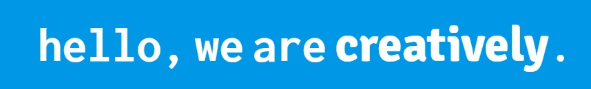

<p align="center">
<a href="https://grzegorz-jodlowski.github.io/creative-agency/"></a>
</p>


# <p align="center">⚡ Creative agency</p>
<p align="center">Project for learning advanced CSS</p>


</br>

## Table of Contents

- [What's this project about?](#about)
- [Technologies used](#technologies)
- [What I learned?](#what)
- [Interesting code snippet](#interesting)
- [GitHub Pages](#gitHub)

</br>

## <a name="about"></a>What's this project about?

Responsive website for a creative agency with drop-down menu, services, portfolio and contact sections.

</br>

## <a name="technologies"></a>Technologies used
- HTML
- CSS (with Flexbox)
- SCSS

</br>

## <a name="what"></a>What I learned?

- create layouts in a modern way,
- write advanced CSS and SCSS,
- use pseudoclasses and pseudoselectors,
- create a multi-level menu,
- set elements on the page using a flexbox,
- add responsiveness to website (using media queries),
- check the appearance of the page on different screens (ex. <a href="http://responsiv.eu/">Responsive View</a>)
- create animation using CSS,
- use the chrome inspector in an advanced way,
- insert fancy social media icons into footer,


</br>

## <a name="interesting"></a>Interesting code snippet (for me of course 😉)
-

```css

}
```


</br>

## <a name="gitHub"></a>GitHub Pages
<a href="https://grzegorz-jodlowski.github.io/creative-agency/">Sample portfolio</a>


